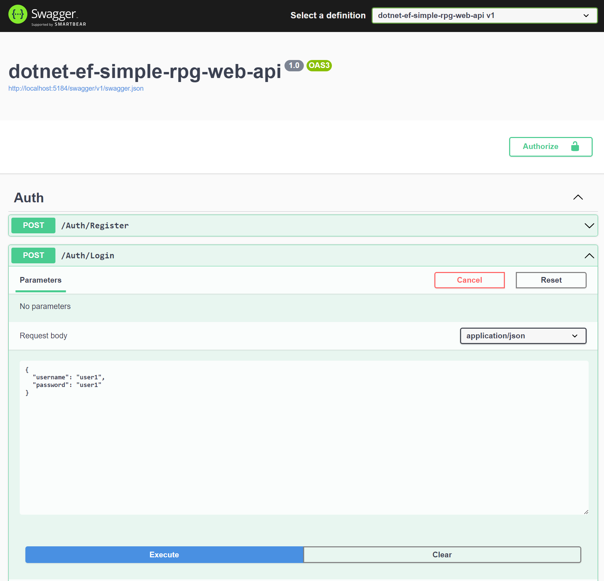
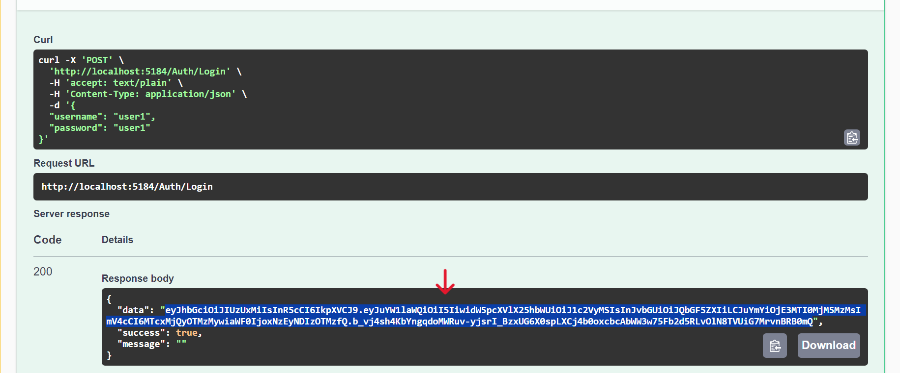
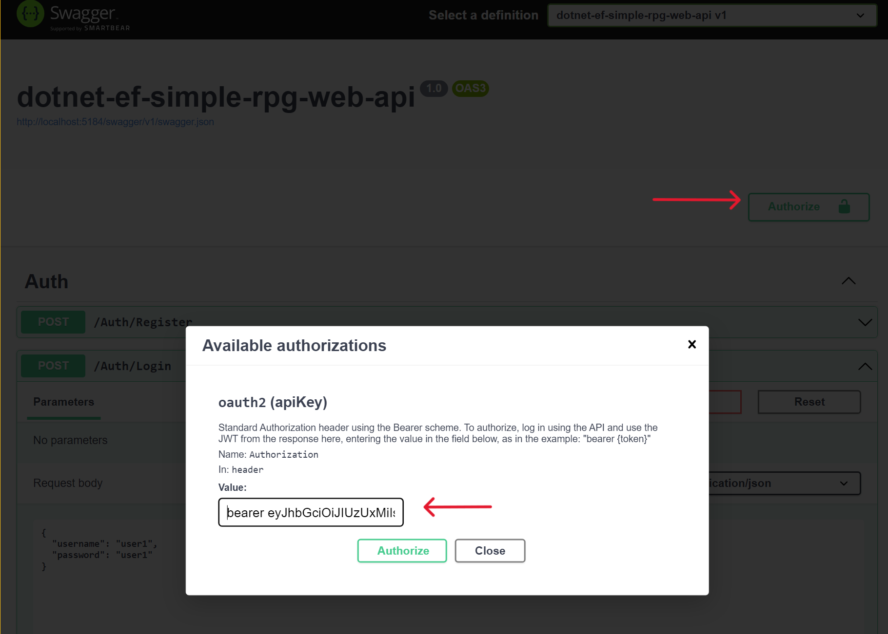
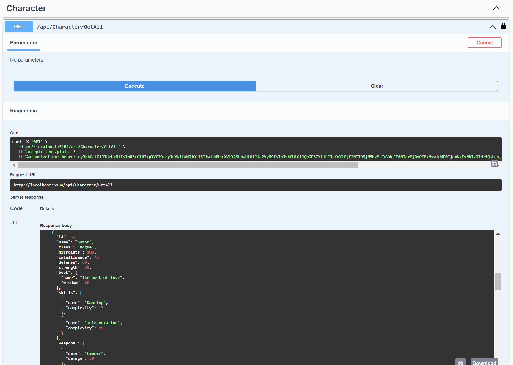
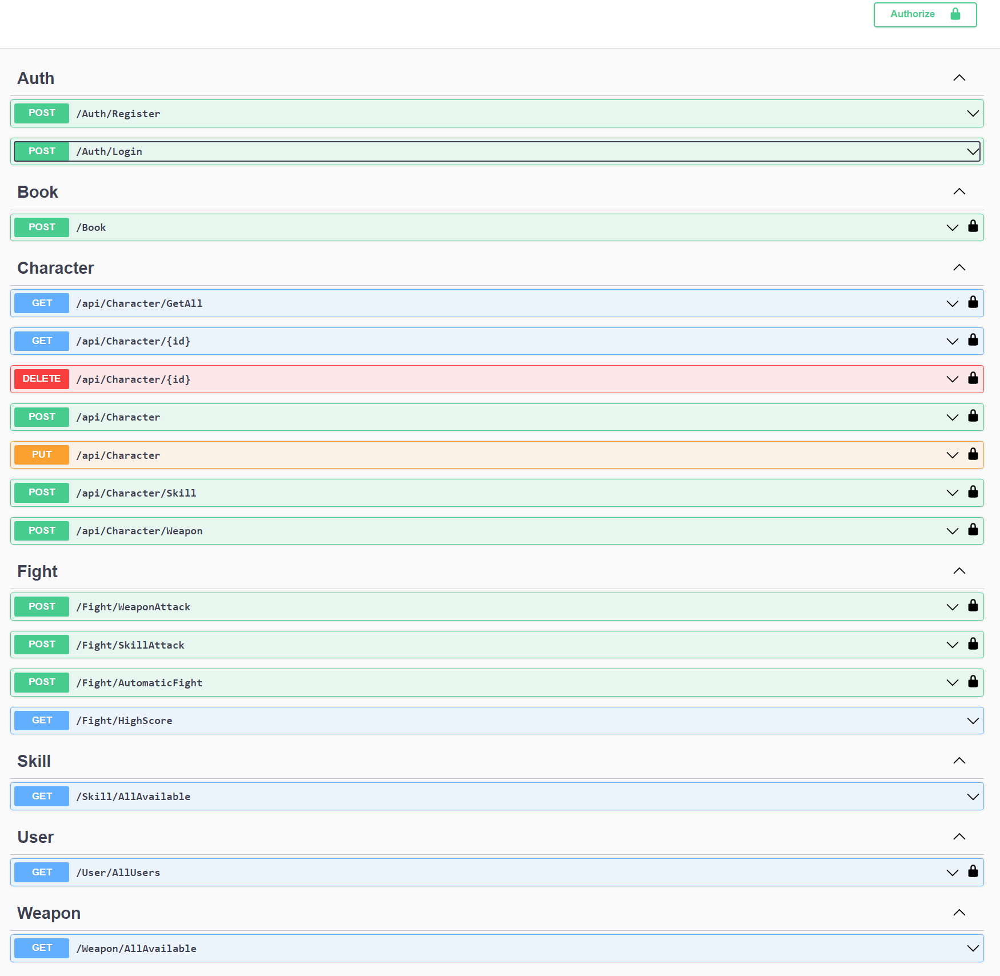
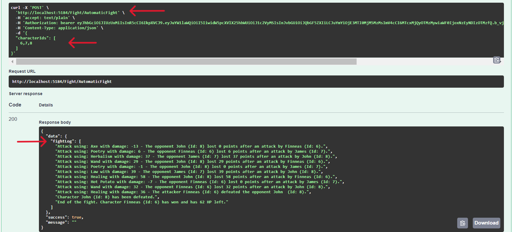

# .NET 8 Web API with Entity Framework and Microsoft SQL Server, created as a basic sample template for creating simple RPG web APIs.

This project serves as a basic sample template for creating simple RPG (Role-Playing Game) web APIs using .NET 8, Entity Framework, and Microsoft SQL Server. It provides a starting point for building MVPs (Minimum Viable Products) for RPG games, showcasing various functionalities with simple implementations such as user authentication, character management, and combat simulations.

## Setup

1. Install Microsoft SQL Server of your choice.
2. Configure the connection string inside `appsettings.json` (and/or `appsettings.Development.json`) file.

    Example of a connection string inside `appsettings.json`:

    ```json
    {
      "ConnectionStrings": {
        "DefaultConnection": "Server=.\\SqlExpress; Database=dotnet-ef-api-rpg-game; Trusted_Connection=true; TrustServerCertificate=true;"
      }
    }
    ```
    For more information on connection strings, refer to the [Microsoft documentation](https://learn.microsoft.com/en-us/dotnet/api/system.data.sqlclient.sqlconnection.connectionstring?view=dotnet-plat-ext-8.0).

3. Install `dotnet-ef` tool if it is not already installed:  
   [dotnet-ef nuget](https://www.nuget.org/packages/dotnet-ef)
   ```sh
   dotnet tool install --global dotnet-ef
   ```
    For more information on Entity Framework tools, please refer to the [Microsoft documentation](https://learn.microsoft.com/en-us/ef/core/cli/dotnet)
   
5. Then to create and update DB, apply migrations:
   ```sh
   dotnet ef database update
   ```

## Examples:
To test the application using Swagger:
   ```sh
   dotnet run
   ```
or with hot reload:
   ```sh
   dotnet watch run
   ```
Ten register new user and login:


To authorize with JWT, copy the JWT from the Login response and use it to authenticate in Swagger. Enter the value in the format described in the popup window ("bearer {token}"):



Users have a default role of "Player". However, if you set up the role as "Admin" (during registration or in the database), accessing all users and characters, not only those assigned to the user, is available.


Other endpoints should be self-explanatory.


To start a fight between characters (you can also fight with other users' characters), add at least 2 characters, assign them skills and weapons, and then start the fight.  
In this simple example, the logic involves the influence of player skills, weapons, intelligence, defense abilities, and other properties, with slight randomization. The death match stops when one player is defeated, and the winner is the player who defeats someone first.  
This is a straightforward implementation, so the result is just a fight log. However, this DTO could be extended to contain every step of the fight in a desired form. This could be used to trigger animations or other actions in a game, either with a simple frontend or in a game made with game engines like Unity, Unreal, etc., that require an API and database to store users and game data.   

